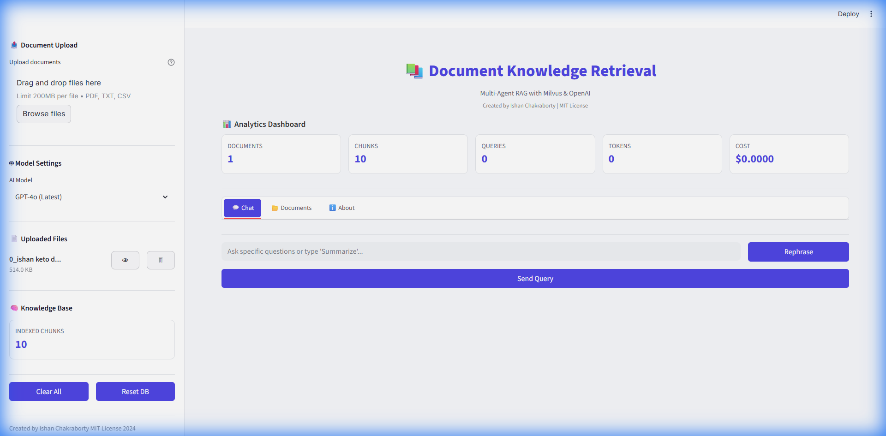
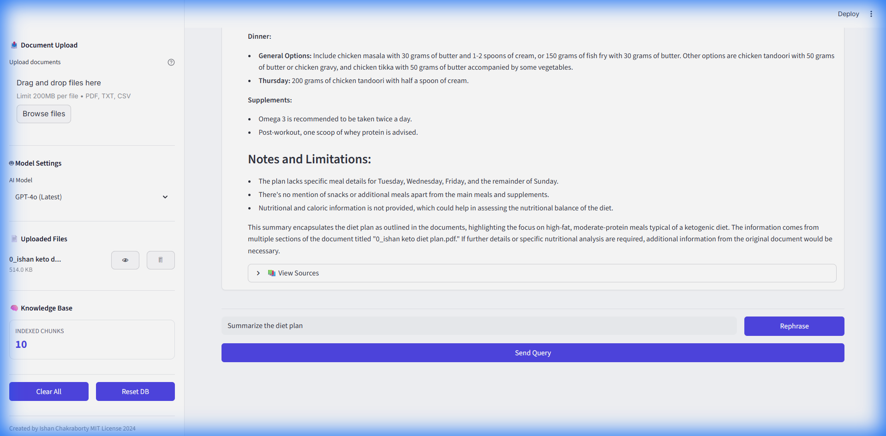
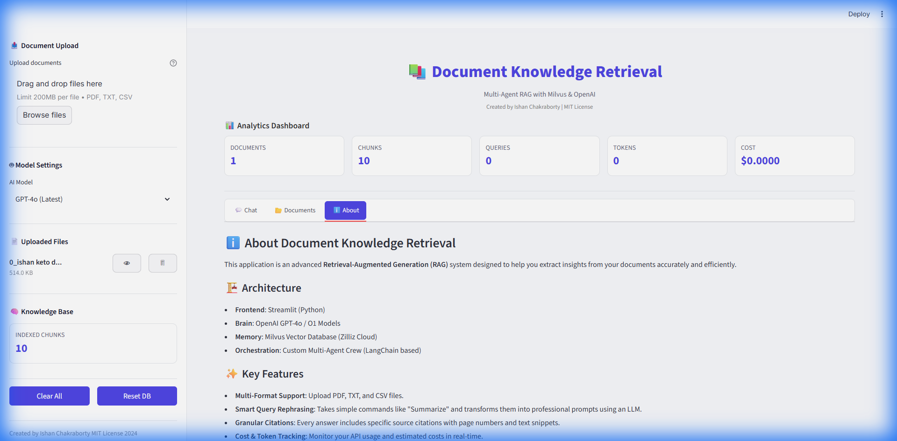

# 📚 Document Knowledge Retrieval Tool

A multi-agent RAG (Retrieval-Augmented Generation) system powered by **CrewAI**, **Milvus**, and **OpenAI**. Upload documents and ask questions using natural language - AI agents will find relevant information and synthesize comprehensive answers.

🌐 **Live Demo**: [https://document-knowledge-retrieval.streamlit.app/](https://document-knowledge-retrieval.streamlit.app/)


## ✨ Key Features

- **📄 Multi-Format Document Ingestion**: Seamlessly upload and process **PDF**, **TXT**, and **CSV** files.
- **🧠 Intelligent Query Understanding**: The system uses an LLM to "rephrase" and expand simple queries (e.g., "Summarize") into professional, detailed prompts for better retrieval.
- **🔍 Precision Retrieval**: Powered by **Milvus** vector database and OpenAI's `text-embedding-3-large` for high-accuracy semantic search.
- **🤖 Multi-Agent Orchestration**: A custom **CrewAI** setup allows specialized agents (Retriever, Responder, Analyzer) to collaborate on your requests.
- **📊 Live Analytics**: Track token usage, chunk counts, and estimated costs in real-time with the built-in dashboard.
- **📚 Accurate Citations**: Every response comes with sources, page numbers, and direct text snippets so you can verify the truth.

### Feature Walkthrough

| Home Screen | AI Response |
|-------------|-------------|
|  |  |

| Documents Tab | About Tab |
|---------------|-----------|
|  |  |

## 🚀 Deployment

**Want to run this app online?**
We have a comprehensive guide for deploying to **Streamlit Community Cloud** for free!

👉 **[Click here to read the Deployment Guide](docs/deployment.md)**

## 📖 How to Use

1. **Upload**: Open the sidebar and browse for your files (PDF, TXT, CSV).
2. **Process**: Click the **"Process New Documents"** button. The system will chunk and index your content into Milvus.
3. **Ask**: Type your question in the chat input.
   - *Tip*: You can type simple commands like "Summarize" and click **"Rephrase"** to see how the AI optimizes your query!
4. **Learn**: Read the AI's response and expand the **"📚 View Sources"** dropdown to see the exact text used to generate the answer.
5. **Monitor**: Check the top dashboard to see how many tokens and chunks you are using.

## 💻 Local Quick Start

### 1. Install Dependencies

```bash
pip install -r requirements.txt
```

### 2. Configure Environment

Copy `.env.example` to `.env` and fill in your credentials (OpenAI & Milvus):

```bash
cp .env.example .env
```

## 🏗️ Architecture

```
┌─────────────────────────────────────────────────────────────┐
│                    Streamlit UI                              │
├─────────────────────────────────────────────────────────────┤
│  Upload → Process → Query → Display                         │
└─────────────────────────────────────────────────────────────┘
                            ↓
┌─────────────────────────────────────────────────────────────┐
│                  CrewAI Agents                               │
├───────────────────┬───────────────────┬─────────────────────┤
│ Retrieval Agent   │ Response Agent    │ Analyzer Agent      │
└───────────────────┴───────────────────┴─────────────────────┘
                            ↓
┌─────────────────────────────────────────────────────────────┐
│  Milvus (Zilliz Cloud) + OpenAI text-embedding-3-large      │
└─────────────────────────────────────────────────────────────┘
```

## 📁 Project Structure

```
DocumentKnowledge Retrieval Tool/
├── app.py                    # Streamlit entry point
├── config.py                 # Configuration management
├── requirements.txt          # Dependencies
├── .env                      # Environment variables (create from .env.example)
├── src/
│   ├── document_processor.py # PDF/document handling
│   ├── vector_store.py       # Milvus integration
│   ├── agents.py             # CrewAI agents
│   ├── tasks.py              # Agent tasks
│   └── crew.py               # Crew orchestration
└── data/uploads/             # Uploaded documents
```

## 🔧 Configuration Options

| Variable | Description | Default |
|----------|-------------|---------|
| `OPENAI_API_KEY` | OpenAI API key | Required |
| `OPENAI_MODEL_NAME` | LLM model | `gpt-4o-mini` |
| `OPENAI_EMBEDDING_MODEL` | Embedding model | `text-embedding-3-large` |
| `MILVUS_URI` | Zilliz Cloud endpoint | Required |
| `MILVUS_TOKEN` | Zilliz auth token | Required |
| `CHUNK_SIZE` | Document chunk size | `1000` |
| `CHUNK_OVERLAP` | Chunk overlap | `200` |

## 📝 License

MIT License
